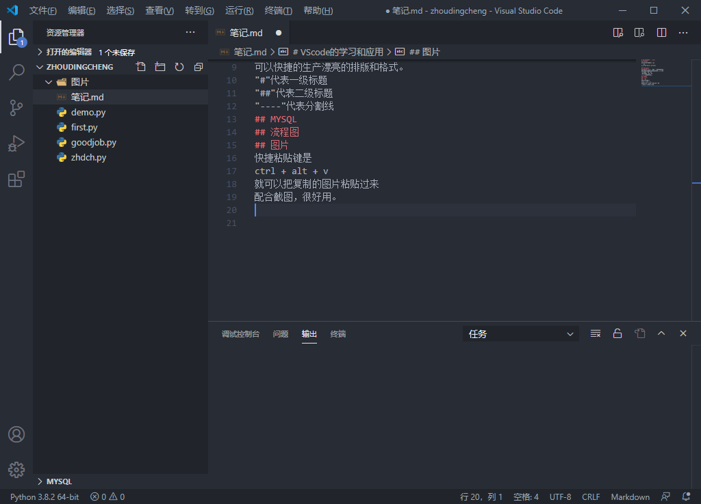

# VScode的学习和应用
## Python
python的后缀名是.py
```py
print（"hello world）
```
## Markdown
后缀名是.md
markdown是当前一种流行写文档的语言
可以快捷的生产漂亮的排版和格式。
"#"代表一级标题
"##"代表二级标题
"----"代表分割线
## MYSQL
cmd输入ipconfig查看本机IP
## 流程图
流程图的后缀名是.dio

## 图片
快捷粘贴键是
ctrl + alt + v
就可以把复制的图片粘贴过来
配合截图，很好用。
真棒！

## Git的配置
注册GitHub网站
安装git
VScode设置里面弄好git的路径
在git bash里做好设置
同步github
